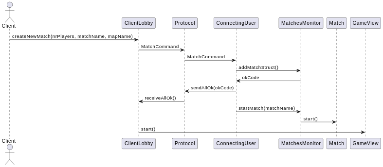
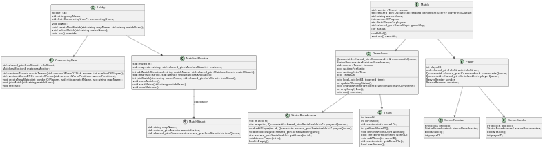
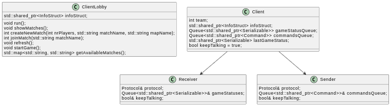
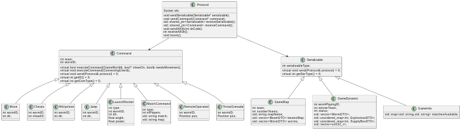

# Documentacion Tecnica

## Requisitos 

????

## El Juego

La logica de comunicacion se dividio en dos partes: cliente y servidor. El servidor es quien cuenta con la logica del juego, tambien asi esta en contacto con la fisica provista por box2d. Por otro lado, el jugador solo maneja la parte visual y los comandos del usuario. El cliente y el  servidor se comunican mediante sockets, haciendo uso de un protocolo de comunicacion. Para simplificar la comunicacion, se hizo uso de la herencia de los objetos la cual permite contar con dos clases madre que envielven la logica necesaria.

El uso de un socket aceptador en el servidor permite contar con un juego multijugador, una clase Player permite encapsular el comportamiento de cada cliente, enviando y recibiendo sus mensajes. 

La consigna pide un juego multi-partidas, donde puedan suceder 2 o mas partidas en simultaneo, para ello se hace uso de las Threads. Cada partida se encuentra en su propia thread, asi tambien la clase encargada de unir a los jugadores a una partida existente o crear una nueva, de esta forma puede esperar el input del usuario sin bloquear al socket aceptador. 

El cliente se comunica con el servidor por medio de Commands, el servidor luego parsea estos commands y se los comunica a la fisica, la cual devuelve el nuevo estado del mundo como respuesta, el servidor le devulve al cliene un nuevo estado de GameDynamic con el mundo actualizado.

## El Servidor

Como se menciono anteriormente el servidor es el encargado de la logica del juego, esto no solo implica el momento donde se juega, sino la parte previa de creacion de partidas.

La clase Lobby tiene al socket acceptador, el MatchesMonitor y a los diferentes ConnectingUser. El MatchesMonitor es como indica su nombre, un monitor que maneja al recurso compartido mapa de Match, todos los connecting users acceden a este mapa para incluir a los jugadores a una partida o para crear una partida desde cero. Por ello es necesario que el map se encuentre monitoreado, evitando asi posibles Race Conditions, como dos usuarios queriendo unirse a una partida donde solo jay un lugar disponibl. La ConnectincUser es una clase encargada de comunicarse con el cliente previo crear/join un Match. Permite crear una nueva partida, unirse a una partida ya existente, y obtener informacion sobre las partidas disponibles. Es importante que el cliente pueda actualizar las partidas disponibles para ver cuales siguen teniendo espacio disponible. 

Durante el proceso de empezar/seleccionar una partida, el cliente se comunica con el protocolo mediante el uso de un MatchCommand, expresando la accion que quiere realizar. Si la accion es posible, el cliente recibe un codigo de todo Ok, en caso de error, recibe un codigo de error. Si la accion que desea hacer el usuario es _refresh_ el cliente va a recibir un GameInfo, una clase que hereda de Serializable (la clase madre que recibe el cliente y envia el protocolo) con la informacion de las partidas disponibles al momento. 

Una partida esta dividida en dos partes: un Match y un GameLoop. 

#### La Primera Parte: Match

El Match es lo que podriamos llamar la previa de la partida, donde se crean los Players, el StatusBroadcaster y la CommandQueue. La clase Player es la encargade de la comunicacion con su usuario conectado. Cada Player representa a un usuario, y cuenta con dos threads ServerSender y ServerReceiver, para comunicarse con el cliente. El StatusBroadcaster y la CommanQueue organizan la comunicacion de cada player. El StatusBroadcaster brodcastea los nuevos estados de GameDynamic para que el cliente pueda procesarlos en la UI. La CommandsQueue recibe los comandos de todos los usuarios y se los da al GameWorld para que los maneje. El ServerSender tiene al StatusBroadcaster y se encarga de enviar por el protocolo lo que le corresponde a ese Player. El ServerReceiver tiene una instacia de la CommandsQueue y se encarga de pushear todo lo que recibe en ella. Match recibe a los nuevos jugadores por medio de una Queue que lo conecta por medio del MatchMonitor con los nuevos ConnectingUsers. Esta queue es la encargada de pasarle al Match el Protocol del nuevo jugador para poder crear al Player. Cuando se unio la cantidad deseada de jugadores, Match da paso a la parte 2 -> GameLoop.

Cada Player envia al cliente un GameMap (clase que ereda de Serializable) para comunicar el estado inicial del Mapa elegido: donde se encuentran las diferentes vigas, donde se encuentran los gusanos, la cantidad de jugadores en la partida, el id del jugador, y el nombre del mapa. Esta informacion permite mostrar visualmente el mapa en su estado inicial. 

#### La Segunda Parte: GameLoop

El GameLoop es el encargado de mediar entre el usuario y la logica fisica del juego, manteniendo tambien el sistema de turnos y alertando en caso de que la partida termine. Por ello GameLoop tiene referencias al StatusBroadcaster, la CommandQueue y el GameWorld. Las instancias de cada una de estas clases fueron creadas por el Match, y son unicas a cada partida. De esta forma no hay posibilidad de informacion cruzada entre partidas. El GameLoop tambien posee una referencia a los Team, unicos de la partida. Cada Team guarda la informacion pertinente a sus gusanos, para que el GameLoop pueda llevar cuenta de los turnos o si hay algun ganador. Como se menciono, el usuario usa la CommandQueue para comunicarse con el servidor, enviando por protocolo diferentes Command. 

Toda accion que quiera ejecutar el usuario hereda de la clase Command y es recibida por el ServerReceiver, y luego pusheada a la CommandQueue. Las diferentes acciones pueden o no levantar flags del lado del servidor, para seguir la consigna de comportamiento. Los Command que utilizan alguna herramienta levantan una flag especifica indicandole al server que ese usuario tiene una _x_ cantidad de tiempo para realizar alguna accion de movimiento (sin herramientas). Por otro lado, las flags pueden levantarse por sucesos fisicos del juego, como que el gusano que esta jugando reciba daño, otorgando asi su turno al siguiente en la fila. Todos los jugadores tienen un tiempo determinado _t_ para completar su jugada, en caso de no levantar ninguna de las flags por los motivos anteriores, al pasar el tiempo _t_ el jugador cedera su turno.

El cambio de turno tiene dos etapas. La primera implica decidir probabilisticamnete si se debe tirar una caja misteriosa, en caso afirmativo, se debe esperar hasta que esta caiga para efectuar el cambio de turno, en caso negativo el cambio de turno debe hacerse al momento. 

Luego de comunicar el Command al GameWorld el GameLoop utiliza la informacion obtenida para generar un GameDynamic, una clase que contiene la informacion actual del juego para que el cliente actualice la visual. 

#### Detalles

Si un jugador se va en medio de una partida de 2 o + usuarios, la partida se mantiene viva. El/Los gusano/s pertenecientes al usuario que se fue no realizaran operaciones, pero si pueden seguir siendo afectados por los eventos fisicos a su alrededor. El cambio de turno se ejecutara siempre por el tiempo cumplido. 

Las partidas pueden terminar por 4 motivos: se cerro el servidor, un usuario gano, o todos los usuarios perdieron, todos los jugadores abandonaron la partida. En los ultimos tres casos, estas partidas se cierran, y son marcadas como _inactive_, permitiendo a un nuevo usuario crear una partida con el mismo nombre. En caso de una partida no estar _incative_ intentar esto devolveria error. 

## El Cliente

El cliente por si mismo no conoce la implementacion de la logica del juego. Su funcion es mandar y recibir mensajes para comunicarse con el servidor. Los mensajes que envia son del tipo Command y los que recibe son del tipo Serializable. Al igual que el player cuenta con dos threads de comunicacion de la forma Sender y Receiver que hacen esto posible. El cliente recibe instrucciones por parte del WorldView, que le indica si requiere enviar un comando o recibir el estado actual del juego. El cliente guarda los Serializable en una queue, y le otorga al GameView el ultimo elemento de la queue siempre. En la etapa de ClienteLobby, se comunica con el Lobby grafico para indicas si se pudo crear/unirse a un match, u otorgar la lista mas reciente de matches disponibles.

 > Un diagrama de secuencia de la creacion de un nuevo match: 

## Protocolo de Comunicacion 

El Protocol es quien facilita la comunicacion entre servidor y usuario. Se encarda de manejar el envio de las dos clases madre Serializable y Command. 

Serializable cuenta con 3 clases hija:
    
    - GameDynamic
    - GameInfo
    - GameMap

Las 3 presentan al cliente con la informacion necesaria en los 3 estados del juego. GameInfo es quein contiene la informacion sobre las partidas disponibles a las que el jugador se puede unir. GameMap es la que contiene los estados iniciales de todo lo pertinente para iniciar la partida del lado del cliente -> la posicion de las vigas, de los gusanos, el id del jugador, la cantidad de jugadores. Por ultimo GameDynamic es la encargada de enviar el estado actual del juego -> el gusano del cual es el turno, si hay algun equipo ganador, la salud de cada equipo, la informacion actualizada de cada WormDTO, la informacion de cada ExplosiveDTO y la informacion de las SupplyBoxDTO disponibles. 

Los DTO son las clases que cuentan con la informacion especifica de los objetos dinamicos del mundo. Estos son los objetos que cambian de posicion, de valor o dejan de existir en el mundo.

Command cuenta con 10 clases hiajs: 
    
    - Move
    - Jump 
    - HitUpclose
    - LaunchRocket
    - ThrowGrenade
    - DropDynamite
    - RemoteOperated
    - MatchCommand
    - Cheats

Cada una de estas clases representa una accion especifica que puede hacer el usuario. 

Move, Jump y Cheats son acciones que no utilizan herramientas y no le cuestan el turno al usuario (y pueden ejecutarse en los 3 segundos extra). Move y Jump interactuan directamente con la fisica, recibiendo respuesta en actualizaciones del GameWorld. Mientras que Cheats puede interactuar tanto con GameWorld como con GameLoop, haciendo coasas como cambiar armas o frenar el paso de los turnos o volviendo a los gusanos invencibles. 

HitUpclose, LaunchRocket, ThrowGrenade, RemoteOperated y DropDynamite son consideradas acciones que utilizan herramientas que interactuan todas directamente con el GameWorld, por lo cual su uso genera un cambio de turno, y no pueden ser utilizadas en los 3 segundos extra.  

MatchCommand le permite crear/unirse a una partida y actualizar las partidas disponibles.

Protocol es quien sabe como enviar todas estas sub-clases, mientras que tanto seervidor como cliente envian y reciben punteros a las clases madres. Es la clase que tiene acceso a los sockets de ambas partes y por ello sabe como enviar los diferentes tipos de datos.  

Se trabajo en todas las partes posibles con shared_pointers para un manejo de memoria optimo. 

## Diagramas de clase

> Servidor

> Cliente

> Protocolo

